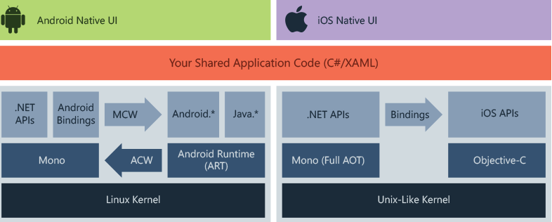

# Reading Notes 34 - Xamarin

The title of this one is named payment processing, however Xamarin was the file that was linked.

Article: https://docs.microsoft.com/en-us/xamarin/get-started/what-is-xamarin

Xamarin is an open source platform for building modern and performant apps in iOS, Android and windows with .NET.  
It is an abstraction layer that manages communication of shared code with underlying platform code.

How Xamarin Works:

The diagram shows the overall architecture of a cross-platform Xamarin application. Xamarin allows you to create native UI on each platform and write business logic in C# that is shared across platforms. In most cases, 80% of application code is sharable using Xamarin.